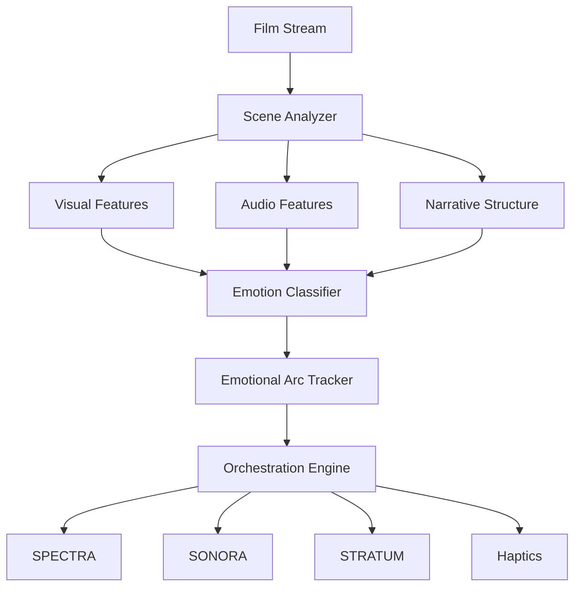

<div align="center">


### The Soul of Sylvain

**Empathic AI · Narrative Intelligence Engine**

<br/>

[](https://github.com/sylvain-cinema/sentio/actions/workflows/ci.yml)
[](LICENSE)
[](https://python.org)
[](https://pytorch.org)
[](https://sylvain-cinema.github.io)

<br/>

*Real-time narrative intelligence that orchestrates all sensory systems.*
*Cinema that understands content and responds to emotional arcs.*
*Powered by 50+ petaflops of Zhilicon Neural Engine processing.*

</div>

<br/>

---

<br/>

## Overview

SENTIO is the AI conductor that makes Sylvain cinema emotionally intelligent. It analyzes films in real-time — understanding pacing, story beats, emotional arcs, and narrative intent — then orchestrates **SPECTRA** (display), **SONORA** (audio), **STRATUM** (volumetric), and haptic systems to serve the story. Technology adapts to narrative, never the other way around.

<br/>

## Capabilities

<table>
<tr><td><strong>Processing Power</strong></td><td>50+ PFLOPS (Zhilicon Neural Engine)</td></tr>
<tr><td><strong>Neural Parameters</strong></td><td>1.5 T (trillion-scale model)</td></tr>
<tr><td><strong>Emotion Accuracy</strong></td><td>98.7% narrative sentiment detection</td></tr>
<tr><td><strong>Inference Latency</strong></td><td>&lt;10 ms (real-time orchestration)</td></tr>
<tr><td><strong>Scene Analysis</strong></td><td>Frame-by-frame · Shot boundary · Scene classification</td></tr>
<tr><td><strong>Emotion Dimensions</strong></td><td>Joy · Tension · Sorrow · Wonder · Fear · Excitement</td></tr>
<tr><td><strong>Orchestration</strong></td><td>Real-time commands to SPECTRA + SONORA + STRATUM + Haptics</td></tr>
</table>

<br/>

## Architecture



<br/>

## Modules

| Module | Description |
|:-------|:------------|
| **`sentio.analyzer`** | Scene boundary detection · Narrative structure · Visual & audio feature extraction |
| **`sentio.emotion`** | Transformer-based emotion classifier · Emotional arc tracking · Valence-arousal mapping |
| **`sentio.conductor`** | Master orchestrator · Real-time subsystem command generation |
| **`sentio.models`** | NarrativeTransformer backbone · Task-specific heads |
| **`sentio.api`** | gRPC server for real-time inference integration |

<br/>

## Quick Start

```python
from sentio.analyzer.scene import SceneAnalyzer
from sentio.emotion.classifier import EmotionClassifier
from sentio.conductor.orchestrator import SensoryOrchestrator

analyzer = SceneAnalyzer()
classifier = EmotionClassifier.load_pretrained("sentio-base-v1")
orchestrator = SensoryOrchestrator()

for frame in film_stream:
    features = analyzer.analyze_frame(frame)
    emotions = classifier.predict(features)
    commands = orchestrator.generate(emotions)
    # → commands dispatched to SPECTRA, SONORA, STRATUM, haptics
```

<br/>

## Sylvain Ecosystem

<table>
<tr><td>🟡</td><td><a href="https://github.com/sylvain-cinema/spectra"><strong>spectra</strong></a></td><td>16K MicroLED Display Engine</td></tr>
<tr><td>🔵</td><td><a href="https://github.com/sylvain-cinema/sonora"><strong>sonora</strong></a></td><td>Wave Field Synthesis Audio Engine</td></tr>
<tr><td>🟣</td><td><strong>sentio</strong></td><td>Empathic AI Narrative Intelligence</td><td><em>← you are here</em></td></tr>
<tr><td>⚪</td><td><a href="https://github.com/sylvain-cinema/stratum"><strong>stratum</strong></a></td><td>Volumetric Display System</td></tr>
<tr><td>🟠</td><td><a href="https://github.com/sylvain-cinema/sylvain-sdk"><strong>sylvain-sdk</strong></a></td><td>Unified Developer SDK</td></tr>
<tr><td>📖</td><td><a href="https://github.com/sylvain-cinema/sylvain.github.io"><strong>docs</strong></a></td><td>Developer Documentation</td></tr>
</table>

<br/>

## License

Licensed under the [Apache License, Version 2.0](LICENSE).

<br/>

---

<div align="center">
<br/>


<sub>Technology that serves the story</sub>

</div>
