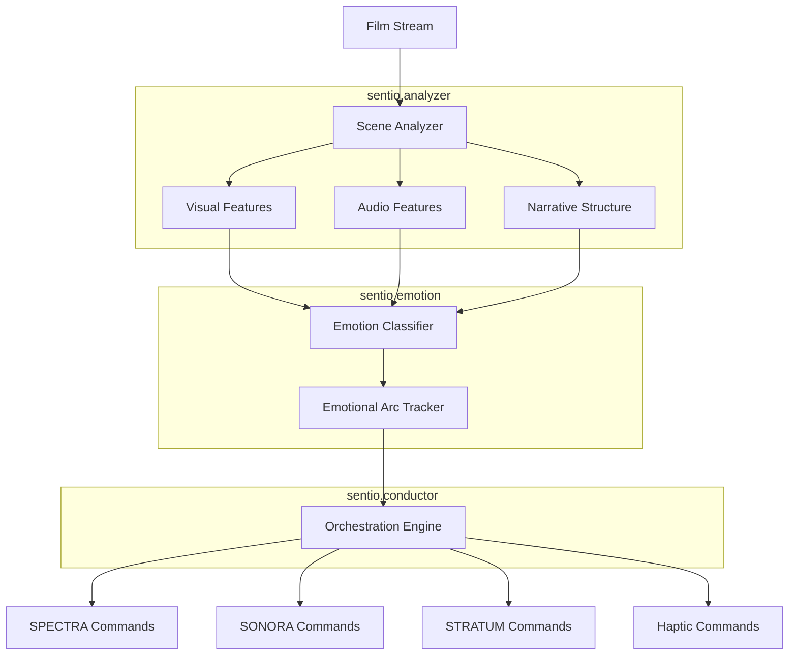

<](https://github.com/sylvain-cinema/sentio/actions)
[](LICENSE)
[](https://python.org)

*Real-time narrative intelligence that orchestrates all sensory systems — cinema that understands content and responds to emotional arcs.*

</div>

---

## Overview

SENTIO is the AI conductor that makes Sylvain cinema emotionally intelligent. Powered by the Zhilicon Neural Engine (50+ petaflops), it analyzes films in real-time — understanding pacing, story beats, emotional arcs, and narrative intent — then orchestrates SPECTRA (display), SONORA (audio), STRATUM (volumetric), and haptic systems to serve the story.

### Capabilities

- **Scene Analysis**: Shot boundary detection, scene classification, visual/audio feature extraction
- **Emotion Classification**: Multi-label emotion detection (joy, tension, sorrow, wonder, fear, excitement)
- **Emotional Arc Tracking**: Temporal smoothing and narrative trajectory prediction
- **Sensory Orchestration**: Real-time command generation for all Sylvain subsystems at 60fps

## Architecture



## Modules

| Module | Description |
|--------|-------------|
| `sentio.analyzer` | Scene boundary detection, narrative structure, visual/audio feature extraction |
| `sentio.emotion` | Transformer-based emotion classifier, emotional arc tracking, valence-arousal mapping |
| `sentio.conductor` | Master orchestrator generating real-time commands for all subsystems |
| `sentio.models` | Neural network architectures — NarrativeTransformer backbone |
| `sentio.api` | gRPC server for real-time inference integration |

## Quick Start

```python
from sentio.analyzer.scene import SceneAnalyzer
from sentio.emotion.classifier import EmotionClassifier
from sentio.conductor.orchestrator import SensoryOrchestrator

analyzer = SceneAnalyzer()
classifier = EmotionClassifier.load_pretrained("sentio-base-v1")
orchestrator = SensoryOrchestrator()

for frame in film_stream:
    features = analyzer.analyze(frame)
    emotions = classifier.predict(features)
    commands = orchestrator.generate(emotions)
    # commands sent to SPECTRA, SONORA, STRATUM, haptics
```

## Sylvain Ecosystem

| Repository | Description |
|-----------|-------------|
| [spectra](https://github.com/sylvain-cinema/spectra) | 16K MicroLED Display Engine |
| [sonora](https://github.com/sylvain-cinema/sonora) | Wave Field Synthesis Audio Engine |
| **sentio** (this repo) | Empathic AI Narrative Intelligence |
| [stratum](https://github.com/sylvain-cinema/stratum) | Volumetric Display System |
| [sylvain-sdk](https://github.com/sylvain-cinema/sylvain-sdk) | Unified Developer SDK |
| [content-pipeline](https://github.com/sylvain-cinema/content-pipeline) | Content Mastering Pipeline |

## License

Apache License 2.0. See [LICENSE](LICENSE).

---

<div align="center">
<strong>SYLVAIN</strong> — The Future of Cinematic Storytelling<br>
<sub>Technology that serves the story</sub>
</div>
]]>